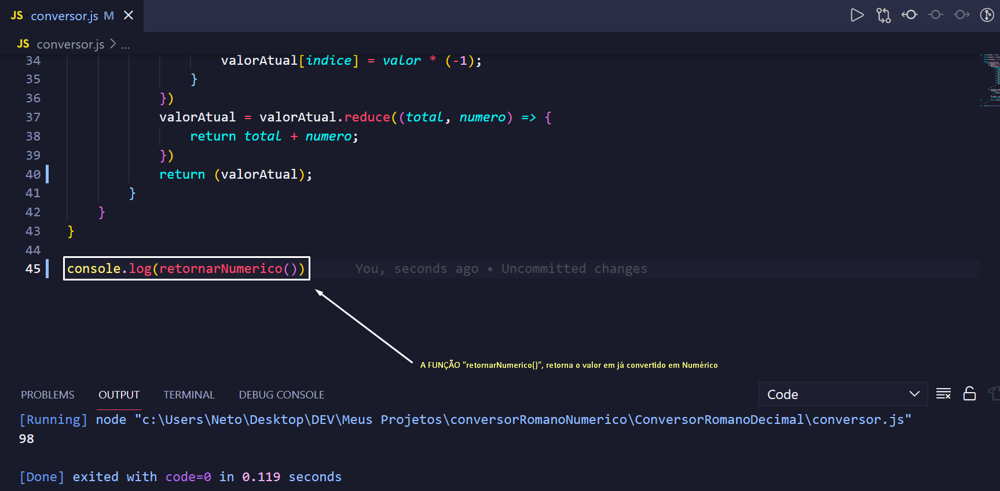

<h1 align="center">
   Foco Total
</h1>

 

## :camera: Demonstração

## :rocket: Tecnologias

Esse projeto foi desenvolvido com as seguintes tecnologias:

✔️Javascript

## 💻 Projeto

Se trata de um conversor de Numeração Romana para Numeração Decimal.

## ⚙ Configuração

Atenção! É necessário que você tenha um compilador Javascript!
